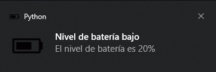

# Programa de monitoreo de batería

Este programa verifica constantemente el porcentaje de batería del equipo y muestra una notificación al usuario si el porcentaje es menor o igual a 20 y el equipo no está cargando.

## Requerimientos

- psutil
- plyer

## Instalación

1. Clonar este repositorio:
```bash
git clone https://github.com/brianrscode/battery-notifier.git
```
2. Instalar los requerimientos:
```bash
pip install -r requirements.txt
```

## Uso

Desde la línea de comandos, navegar hasta la carpeta donde se encuentra el archivo `main.py` y ejecutar el comando:
```bash
python main.py
```
De esta forma, cuando la batería esté baja mostrará una notificación como la siguiente:
<div align="center">
    
</div>

**Recuerda que para utilizar estos programas, es necesario tener instalados los requerimientos. También es importante ajustar los umbrales de los porcentajes de batería según tus necesidades. ¡Espero que te sean útiles!**
